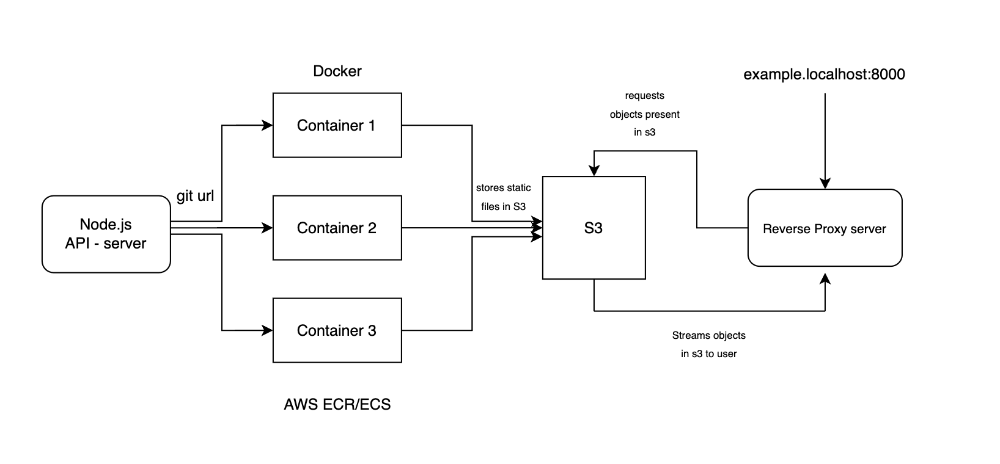

# Vercel Clone

## Project Overview
The Vercel Clone is a web application designed to allow users to effortlessly host their projects. Users begin by providing the Git URL of their project. This triggers the application to run a Docker image that is pushed to Amazon Elastic Container Registry (ECR). The image creates and runs a container on Amazon Elastic Container Service (ECS), which builds the user's project and stores all output files in Amazon S3. After the build is complete, users receive a generated link that directs them to their hosted project. The application features a reverse proxy server that accesses the S3 objects and streams them to the user when they click the generated link. Additionally, to enhance user experience, real-time logs of the build process, container execution, and file uploads are displayed using Redis and Socket.IO.

## Architecture


## Project Setup Information

### Frontend Setup
1. **Technologies Used:**  
   - React.js for the frontend UI.
   - Tailwind CSS for styling.

2. **Installation:**
   - Clone the repository:
     ```bash
     git clone https://github.com/yourusername/vercel-clone.git
     ```
   - Navigate to the frontend directory:
     ```bash
     cd vercel-clone/my-vite-app
     ```
   - Install dependencies:
     ```bash
     npm install
     ```
   - Start the frontend server:
     ```bash
     npm run dev
     ```

### Backend Setup
1. **Technologies Used:**  
   - Node.js with Express for the API server.
   - HTTP-Proxy for reverse proxy functionality.
   - Redis for log management.
   - Socket.IO for real-time log updates.

### Docker Setup
1. **Building Docker Images:**
   - Ensure you have Docker installed and running.
   - Build the Docker image for your application:
     ```bash
     docker build -t your-image-name .
     ```

2. **Pushing to ECR:**
   - Authenticate your Docker client to your Amazon ECR registry.
   - Tag your Docker image:
     ```bash
     docker tag your-image-name:latest your-account-id.dkr.ecr.region.amazonaws.com/your-repository:latest
     ```
   - Push the image to ECR:
     ```bash
     docker push your-account-id.dkr.ecr.region.amazonaws.com/your-repository:latest
     ```

### AWS Setup
1. **Required AWS Services:**
   - **ECR:** Create an Elastic Container Registry to store Docker images.
   - **ECS:** Set up Elastic Container Service to run the Docker containers.
   - **S3:** Create an S3 bucket to store output files.
   - **IAM:** Configure permissions for your services and roles.

2. **Environment Variables:**
   - Ensure that your AWS credentials are properly set up in your environment or through AWS CLI.

### Conclusion
Follow these steps to set up your project locally and deploy it using AWS services. Make sure you have the necessary permissions and configurations set in your AWS account to avoid issues during deployment.

